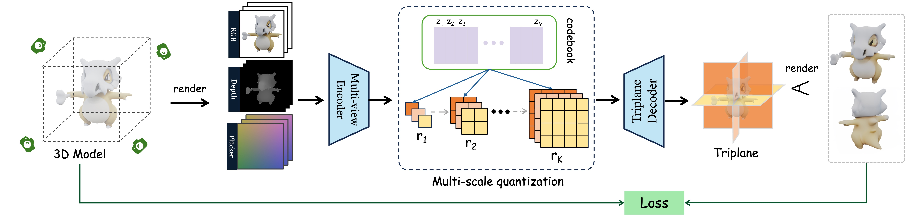
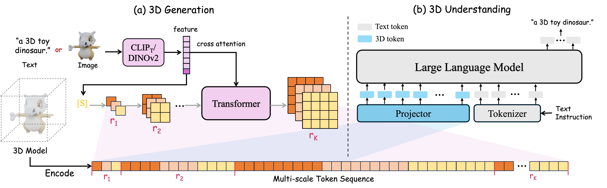

<div align="center">

<h1>
SAR3D: Autoregressive 3D Object Generation and Understanding via Multi-scale 3D VQVAE
</h1>


**[Yongwei Chen¹](https://cyw-3d.github.io), [Yushi Lan¹](https://nirvanalan.github.io), [Shangchen Zhou¹](https://shangchenzhou.com), [Tengfei Wang²](https://tengfei-wang.github.io), [Xingang Pan¹](https://xingangpan.github.io)**

¹S-lab, Nanyang Technological University  
²Shanghai Artificial Intelligence Laboratory

[project page](https://cyw-3d.github.io/projects/SAR3D) | [arXiv](https://arxiv.org/abs/2411.16856)

SAR3D is a framework for **fast 3D generation (<1s)** and **detailed understanding** via **autoregressive modeling**.


https://github.com/user-attachments/assets/badac244-f8ee-41c2-8129-b09cf6404b91


<p align="center">🚀✨🚧 We are working hard on releasing the code... 🔧🛠️💻 Stay tuned! 🚧✨🚀</p>

</div>

## Abstract
Autoregressive models have demonstrated remarkable success across various fields, from large language models (LLMs) to large multimodal models (LMMs) and 2D content generation, moving closer to artificial general intelligence (AGI). Despite these advances, applying autoregressive approaches to 3D object generation and understanding remains largely unexplored. This paper introduces Scale AutoRegressive 3D (SAR3D), a novel framework that leverages a multi-scale 3D vector-quantized variational autoencoder (VQVAE) to tokenize 3D objects for efficient autoregressive generation and detailed understanding. By predicting the next scale in a multi-scale latent representation instead of the next single token, SAR3D reduces generation time significantly, achieving fast 3D object generation in just 0.82 seconds on an A6000 GPU. Additionally, given the tokens enriched with hierarchical 3D-aware information, we finetune a pretrained LLM on them, enabling multimodal comprehension of 3D content. Our experiments show that SAR3D surpasses current 3D generation methods in both speed and quality and allows LLMs to interpret and caption 3D models comprehensively.

## Method

**Overview of Multi-scale VQVAE.** Given a 3D model, we leverage multi-view RGB-D (depth) renderings and Plücker embeddings as the input to our multi-view encoder *𝓔*. The encoder predicts a continuous feature map that is then quantized by the multi-scale quantizer *𝓠*, giving *R = (r₁, r₂, ..., rₖ)* of latent tri-plane features. Each code of different scales shares the same codebook. The triplane decoder then converts the quantized latent triplane features into the triplane representation through a plane-wise manner. The predicted triplane is multi-view supervised with the ground truth image, depth, and normal.



---

**Overview of 3D Generation and 3D Understanding**. Given a 3D model, our 3D VQVAE encodes it into multi-scale discrete tokens for both 3D generation and understandingin.In (a) **3D Generation**, text or a single image is encoded by *CLIP<sub>T</sub>* or *DINOv2*, and the encoded condition features are integrated into the decoder-only transformer via cross attention. The transformer then causally predicts each scale of the latent triplane. In (b) **3D Understanding**, truncated 3D tokens are first processed with an MLP projector. The large language model receives a multimodal sequence of text and 3D tokens and generates a detailed caption describing the input 3D model.



## BibTex

```bibtex
@article{chen2024sar3d,
  title={SAR3D: Autoregressive 3D Object Generation and Understanding via Multi-scale 3D VQVAE},
  author={Chen, Yongwei and Lan, Yushi and Zhou, Shangchen and Wang, Tengfei and Pan, Xingang},
  journal={arXiv preprint arXiv:2411.16856},
  year={2024}
}
